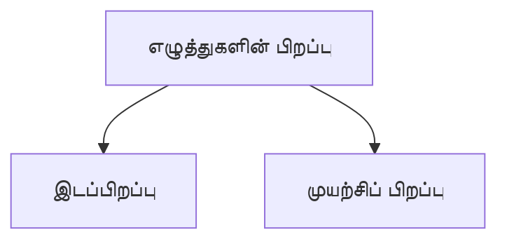

8th
# 1. **எழுத்துகளின் பிறப்பு** (Orgin of letters)
**(i.e.)** From where & how the sound orginates

## **இடப்பிறப்பு**
- **உயிர்** - *கழுத்து*.🦒
- **வல்லினம்** - *மார்பு*.🫁
- **மெல்லினம்** - *மூக்கு*.👃🏻
- **இடையினம்** - *கழுத்து*.🦒
- **ஆய்த எழுத்து** - *தலை*.💀

## **முயற்சிப் பிறப்பு**
### **உயிர் எழுத்துகள்**
- **அ, ஆ** - *வாய்* திறத்தல்.😲
- **இ, ஈ, எ, ஏ, ஐ** - *வாய்* திறத்தல்😲 + *நாக்கின்* அடி ஓரமானது  *மேல்வாய்ப் பல்லைப் பொருந்துதல்.😛
- **உ, ஊ, ஒ, ஓ, ஒள** - *வாய்* திறத்தல்😲 + *இதழ்களைக்* குவிப்பு.😯

### **மெய் எழுத்துகள்**
- **க், ங்** - *நாவின்* முதற்பகுதி👅 + *அண்ணத்தின்* அடிப்பகுதியைப்😦 பொருந்துவதால்.
- **ச், ஞ்** - *நாவின்* இடைப்பகுதி👅 + *நடுஅண்ணத்தின்* இடைப்பகுதியைப்😦 பொருந்துவதால்.
- **ட், ண்** - *நாவின்* நுனி👅 + *அண்ணத்தின்* நுனியைப்😦 பொருந்துவதால்.
- **த், ந்** - *மேல்வாய்ப் பல்லின்* அடி🦷 + *நாக்கின் நுனி*👅 பொருந்துவதால்.
- **ப், ம்** - *மேல் இதழ்*💋 + *கீழ் இதழும்*💋 பொருந்துவதால்.
- **ய்** – *நாக்கின்* அடிப்பகுதி👅 + *மேல் வாயின்*👄 அடிப்பகுதியைப் பொருந்துவதால்.
- **ர், ழ்** - *மேல்வய்*👄 + *நாக்கின்* நுனி👅 வருடுவதால்.
- **ல்** – *மேல்வாய்ப்* பல்லின் அடி🦷 + *நாக்கின்* ஓரங்கள்👅 தடித்து நெருங்குவதால்.
- **ள்** – *மேல்வாய்*👄 + *நாக்கின்* ஓரங்கள்👅 தடித்துத் தடவுதலால்.
- **வ்** – *மேல்வாய்ப்பல்*🦷 + *கீழ் உதடு*💋 பொருந்துவதால்.
- **ற், ன்** - *மேல்வாய்*👄 + *நாக்கின்* நுனி👅 பொருந்துவதால்.

### **சார்பெழுத்துகள்**
- **ஆய்த எழுத்து** - *வாய்* திறத்தல்😲.
- **பிறசார்பெழுத்துகள்** - *முதலெழுத்துகள்* தோன்றும் இடங்கள் & முயற்சி.