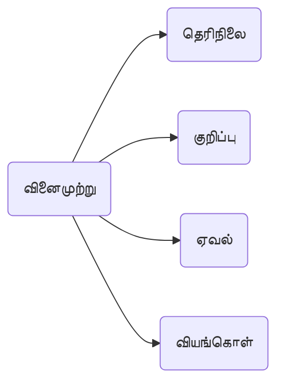
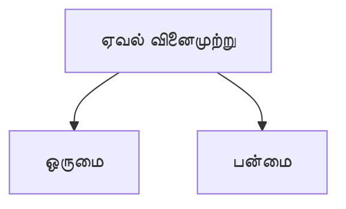

[[Index|⬅️]]
8th
# 2.வினைமுற்று
பொருள் முற்றுப் பெற்ற வினைச்சொற்கள்.

(எ.கொ.)
- மலர்விழி *எழுதினாள்*,
- கண்ணன் *பாடுகிறான்*,
- மாடு *மேயும்*.

## தெரிநிலை வினைமுற்று 👀
1. செய்பவர்🧍‍♂️
2. கருவி🔧
3. நிலம்🛬
4. செயல்💪
5. காலம்⌚
6. செய்பொருள் ⚗️
**வெளிப்படுமாறு** அமைவது.

(எ.கா.) மாணவி கட்டுரை *எழுதினாள்*. 
- செய்பவர் - மாணவி
- கருவி - தாளும் எழுதுகோலும்
- நிலம் - பள்ளி
- செயல் - எழுதுதல்
- காலம் - இறந்தகாலம்
- செய்பொருள் - கட்டுரை

## குறிப்பு வினைமுற்று 👇
1. பொருள்🎲
2. இடம்🌆
3. காலம்⌚
4. சினை (உறுப்பு) 🦵
5. குணம்❤️‍🔥
6. தொழில்👨‍💼
ஒன்றனை அடிப்படையாகக் கொண்டு, **காலத்தை**⌚ வெளிப்படையாகக் **காட்டாது**❌, **செய்பவரை**🧍‍♂️ மட்டும் வெளிப்படையாகக் **காட்டும்**✅.

(எ.கா.) அவன் பொன்னன்.
- பொருள் - பொன்னன்
- இடம் - தென்னாட்டார்
- காலம் - ஆதிரையான்
- சினை - கண்ணன்
- பண்பு (குணம்) - கரியன்
- தொழில் - எழுத்தன்

## ஏவல் வினைமுற்று 👉

(எ.கொ.)
- பாடம் *படி*,
- கடைக்குப் *பொ*.

தன்முன் உள்ள ஒருவர் ஒரு செய்லச் செய்யுமாறு **கட்டளையிடுகின்ற** வினைமுற்று, ஏவல் வினைமுற்று.

(எ.கொ.)
- எழுது – ஒருமை🧍‍♂️ ஏவல் வினைமுற்று
- எழுதுமின் / எழுதுங்கள்– பன்மை 👫 ஏவல் வினைமுற்று
எழுதுங்கள் (இக்கால வழக்கு). 

## வியங்கொள் வினைமுற்று 👋

1. **வாழ்த்துதைல், வைதைல், விதித்தைல், வெண்டல்** ஆகிய பொருள்களில் வரும்.
2. [[இருதிணை]], [[ஐம்பால்]], [[மூவிடம்|மூன்று இடங்க்ளையும்]] கொட்டும். 
3. விகுதிகள் **க, இய, இயர், அல்**.

(எ.கொ.)
- வாழ்க,
- ஒழிக,
- வாழியர்,
- வாரல்.