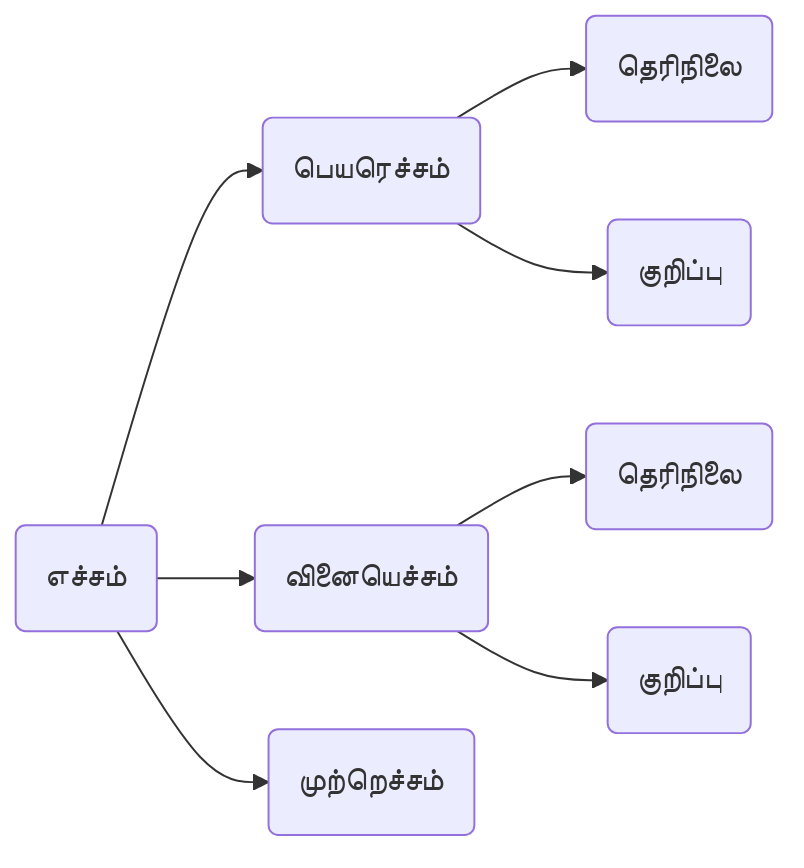

[[Index|⬅️]]
8th
# 3.எச்சம்
- படித்தான் –  வினைமுற்று.
- *படித்த*, *படித்து* - எச்சம்.
(**பொருள்** முற்றுப்பெற வில்லை). 

## பெயரெச்சம் 
- **பெயர்ச்சொற்கள்** கொண்டு **முடியும்**.

(எ.கா.)
- *படித்த* மாணவன்,
- *படித்த* பள்ளி. 
[[மூக்காலம்|மூன்று காலத்திலும்]] வரும். 

(எ.கா.)
- *பாடிய* பாடல் - இறந்தகாலப் பெயரெச்சம்
- *பாடுகின்ற* பாடல் - நிகழ்காலப் பெயரெச்சம்
- *பாடும்* பாடல் - எதிர்கா லப் பெயரெச்சம் 

### தெரிநிலை பெயரெச்சம்
*எழுதிய* கடிதம்
- எழுதிய - எழுதும் **செயலையும்** இறந்த**காலத்தையும்** தெளிவாகக் காட்டுகிறது. 

### குறிப்புப் பெயரெச்சம்
*சிறிய* கடிதம்
- சிறிய - **செயலையோ, காலத்தையோ** தெளிவாகக் **காட்டாமல், பண்பினை மட்டும்** குறிப்பாகக் **காட்டும்**.

## வினையெச்சம்
- **வினைச் சொற்கள்** கொண்டு **முடியும்**.

(எ.கா.)
- *படித்து* முடித்தான்,
- *படித்து* வியந்தான்.

### தெரிநிலை வினையெச்சம்
*எழுதி* வந்தான்
- எழுதி - எழுதும் **செயலையும்**, இறந்த **காலத்தையும்** **தெளிவாகக் காட்டுகிறது**.

### குறிப்பு வினையெச்சம்
*மெல்ல* வந்தான்
- மெல்ல - **காலத்தை வெளிப்படையாகக் காட்டவில்லை**. மெதுவாக என்னும் **பண்பை மட்டும் உணர்த்துகிறது**. 

## முற்றெச்சம் 
வள்ளி படித்தனள்.
- படித்தனள் -> படித்தாள்(வினைமுற்று).

வள்ளி *படித்தனள்* மகிழ்ந்தாள்.
- படித்தனள் -> படித்து(வினையெச்சம்). 
**வினைமுற்று எச்சப்பொருள் தந்து மற்றொரு வினைமுற்றைக் கொண்டு முடிவது** முற்றெச்சம்.