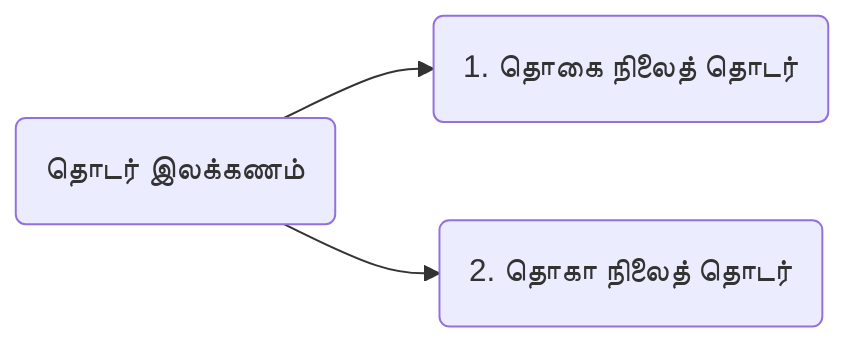
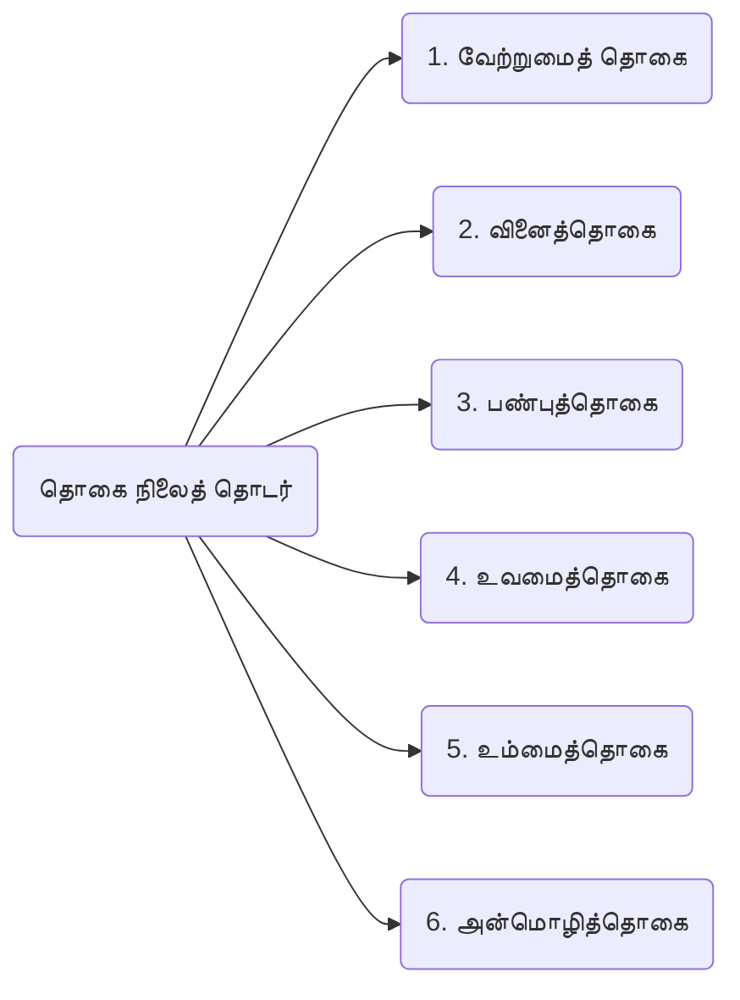
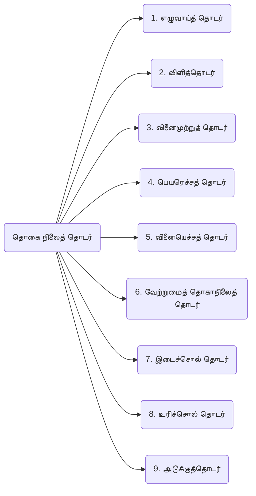

[[Index|⬅️]]
8th

# 5.தொடர் இலக்கணம்

# தொகைநிலை தொதடர்

**வேற்றுமை உருபுகளோ , வினை, பண்பு** முதலியவற்றின் உருபுகளோ **தொக்கி (மறைந்து)** வருமானால் - **தொகை நிலைத்** தொடர்

# தொகாநிலைத் தொதடர்
ஒரு தொடரில் இரு சொற்கள் வந்து அவற்றின் இடையில் எச்சொல்லும் எவ்வுருபும் **மறையாமல்** நின்று பொருள் உணர்த்தினால் - **தொகாநிலைத்** தொடர்

# இடைச்சொல் – உரிச்சொல்