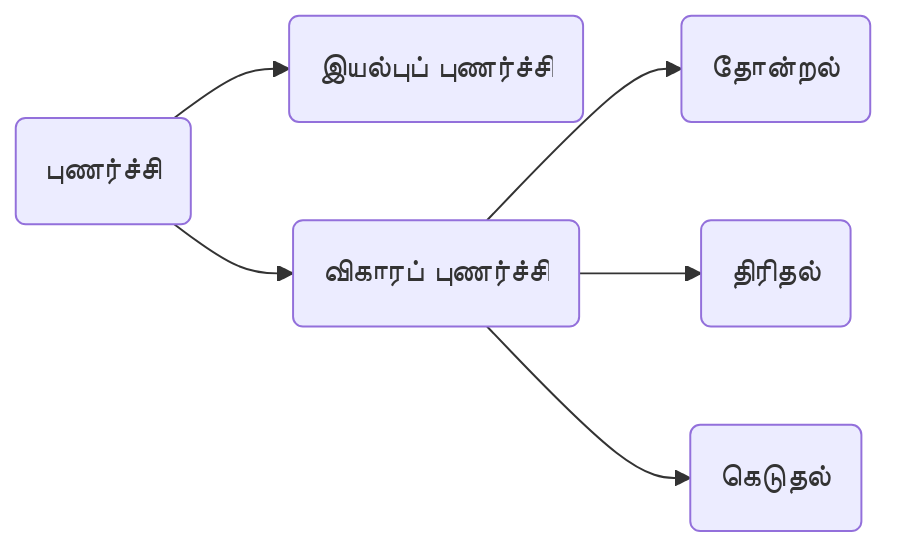
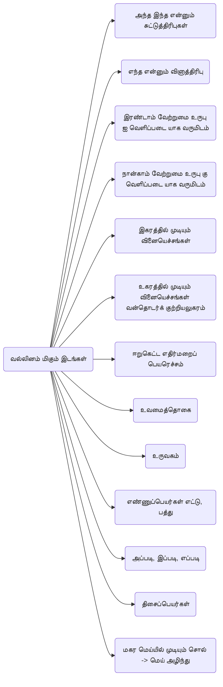
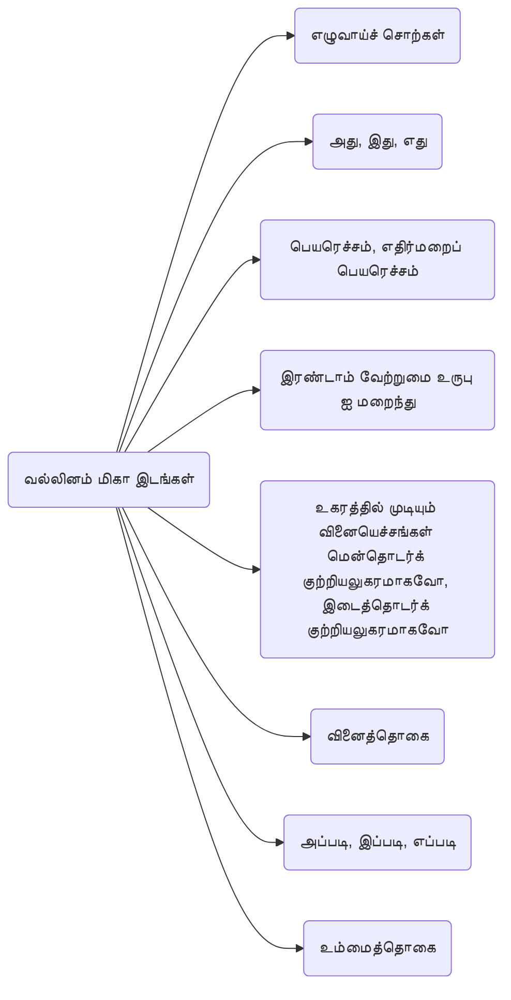

[[Index|⬅️]]
8th
# 6.புணர்ச்சி
**நிலைமொழி ஈறும், வருமொழி முதலும் இணைவது** புணர்ச்சி

- **நிலைமொழியின்** இறுதி எழுத்து **உயிர்** எழுத்து -> **உயிரீற்றுப்** புணர்ச்சி.
(எ.கா.) சிலை + அழகு = சிலையழகு (லை=ல்+ஐ)
- **நிலைமொழியின்** இறுதி எழுத்து **மெய்** எழுத்து -> **மெய்யீற்றுப்** புணர்ச்சி.
(எ.கா.) மண் + அழகு = மண்ணழகு
- **வருமொழியின்** முதல் எழுத்து **உயிர்** எழுத்து -> **உயிர்முதல்** புணர்ச்சி.
(எ.கா.) பொன் + உண்டு = பொன்னுண்டு
- **வருமொழியின்** முதல் எழுத்து **மெய்** எழுத்து -> **மெய்முதல்** புணர்ச்சி .
(எ.கா.) பொன் + சிலை = பொற்சிலை (சி = ச்+ இ)

# வல்லினம் மிகும் இடங்களும் மிகா இடங்களும்

சொல்லின் முதலெழுத்து **க, ச, த, ப** களுள் ஒன்றாக இருந்தால், அதற்கு முன்னால் உள்ள சொல்லின் இறுதியில் அந்த வல்லின மெய்எழுத்தைச் சேர்த்து எழுத வேண்டும்.

வல்லினம்மிக வேண்டிய இடத்தில் மிகாமல் எழுதுவதும் மிகக் கூடாத இடத்தில் வல்லின மெய் இட்டு எழுதுவதும் -> **சந்திப் பிழை** / **ஒற்றுப்பிழை**.

## வல்லினம் மிகும் இடங்கள்

## வல்லினம் மிகா இடங்கள்

