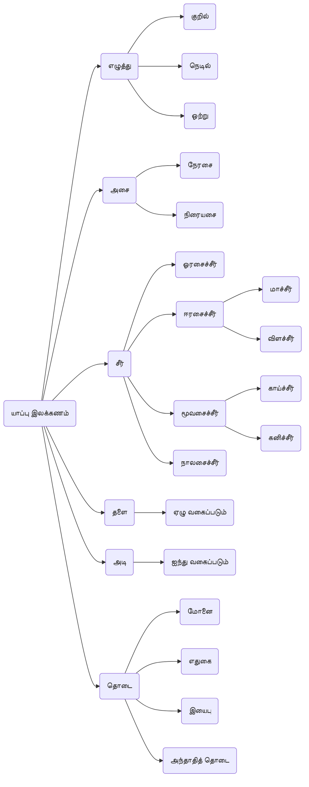
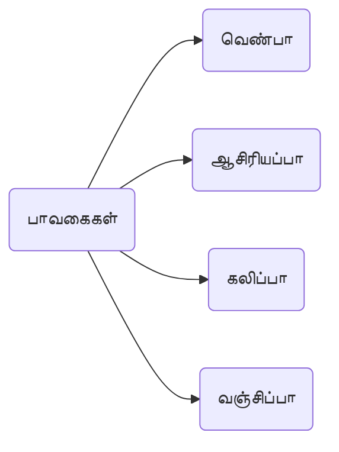

[[Index|⬅️]]
8th / 9th
# 8.யாப்பு இலக்கணம்
- **இலக்கணத்திற்கு உட்பட்டு** எழுதப்படும் கவிதைகளை **மரபுக்கவிதைகள்**.
- மரபுக்கவிதைகள் **எழுதுவதற்கான** இலக்கணம் **யாப்பு இலக்கணம்**.

## அசை 
### நேரசை 
- தனிக்குறில்
- தனிக்குறில், ஒற்று
- தனிநெடில்
- தனிநெடில், ஒற்று
### நிரையசை
- இருகுறில்
- இருகுறில், ஒற்று
- குறில், நெடில்
- குறில், நெடில், ஒற்று

## சீர்
## ஓரசைச் சீர்
- நேர் -> **நாள்**
- நிரை -> **மலர்**
- நேர்பு -> **காசு**
- நிரைபு -> **பிறப்பு**

## ஈரசைச் சீர்
### மாச்சீர்
- நேர் நேர் -> **தேமா** 
- நிரை நேர் -> **புளிமா**
### விளச்சீர்
- நிரை நிரை -> **கருவிளம்** 
- நேர் நிரை -> **கூவிளம்** 

## மூவசைச் சீர்
### காய்ச்சீர் (வெண்சீர்கள்)
- நேர் நேர் நேர் -> **தேமாங்காய்**
- நிரை நேர் நேர் -> **புளிமாங்காய்**
- நிரை நிரை நேர் -> **கருவிளங்காய்**
- நேர் நிரை நேர் -> **கூவிளங்காய்**
### கனிச்சீர் 
- நேர் நேர் நிரை -> **தேமாங்கனி**
- நிரைநேர்நிரை -> **புளிமாங்கனி**
- நிரை நிரை நிரை -> **கருவிளங்கனி**
- நேர் நிரை நிரை -> **கூவிளங்கனி**

## திருக்குறள் அலகிடல்
- வெண்பாவில் **இயற்சீரும், வெண்சீரும்**. 
- தளைகளில் **இயற்சீர்** வெண்டளையும், **வெண்சீர்** வெண்டளையும்.
- ஈற்றடியின் ஈற்றுச் சீர் **ஓரசைச் சீர்**களில் முடியும்.

## தளை 
1. மா முன் நேர் -> **நேரொன்றாசிரியத்தளை**
2. விளம் முன் நிரை -> **நிரையொன்றாசிரியத்தளை**
3. மா முன் நிரை, விளம் முன் நேர் -> **இயற்சீர் வெண்டளை**
4. காய் முன் நேர் -> **வெண்சீர் வெண்டளை**
5. காய் முன் நிரை -> **கலித்தளை**
6. கனி முன் நிரை -> **ஒன்றிய வஞ்சித்தளை**
7. கனி முன் நேர் -> **ஒன்றா வஞ்சித்தளை**

## அடி
1. இரண்டு சீர்கள் -> **குறளடி**
2. மூன்று சீர்கள் -> **சிந்தடி**
3. நான்கு சீர்கள் -> **அளவடி**
4. ஐந்து சீர்கள் -> **நெடிலடி**
5. ஆறுசீர் அல்லது அதற்கு மேற்பட்ட சீர்கள் -> **கழிநெடிலடி**. 
 