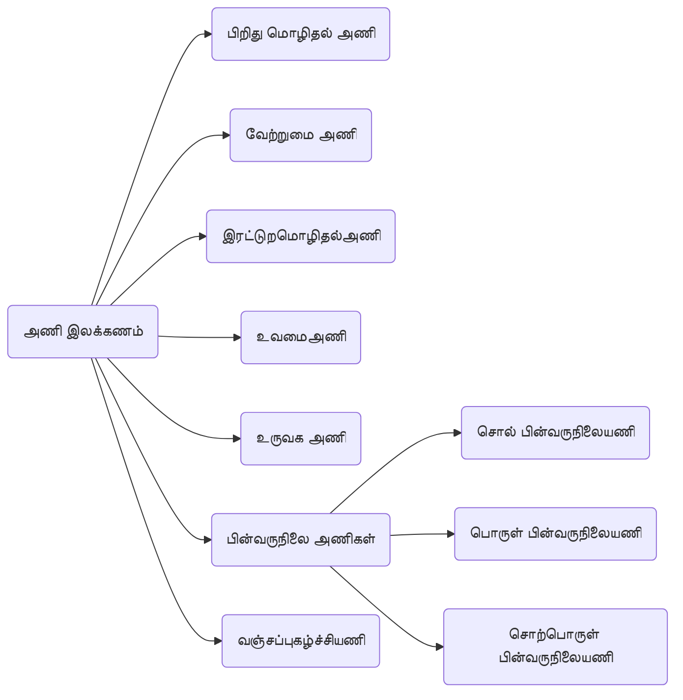

[[Index|⬅️]]
8th / 9th
# 9.அணி இலக்கணம்

```mermaid
graph LR;
	A("அணி இலக்கணம்");
    A-->B("பிறிது மொழிதல் அணி");
    A-->C("வேற்றுமை அணி");
    A-->D("இரட்டுறமொழிதல்அணி");
    A-->E("உவமைஅணி");
    A-->F("உருவக அணி");
    A-->G("பின்வருநிலை அணிகள்");
    A-->H("வஞ்சப்புகழ்ச்சியணி");
    G-->I("சொல் பின்வருநிலையணி");
    G-->J("பொருள் பின்வருநிலையணி");
    G-->K("சொற்பொருள் பின்வருநிலையணி");
```